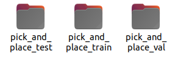
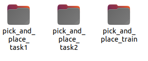
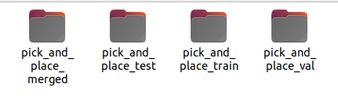

# Dataset Edit

데이터셋 편집 도구

# 데이터셋 도구 사용하기

이 가이드는 LeRobot에서 기존 데이터셋을 수정하고 편집할 수 있는 데이터셋 도구 유틸리티를 다룹니다.

## 개요

LeRobot은 데이터셋을 조작하기 위한 여러 유틸리티를 제공합니다:

1.  **에피소드 삭제 (Delete Episodes)** - 데이터셋에서 특정 에피소드 제거
2.  **데이터셋 분할 (Split Dataset)** - 데이터셋을 여러 개의 작은 데이터셋으로 나누기
3.  **데이터셋 병합 (Merge Datasets)** - 여러 데이터셋을 하나로 결합. 데이터셋들은 동일한 특성(features)을 가져야 하며, 에피소드는 `repo_ids`에 지정된 순서대로 연결됩니다.
4.  **특성 제거 (Remove Features)** - 데이터셋에서 특성 제거


핵심 구현은 `lerobot.datasets.dataset_tools`에 있습니다.

도구 API 사용 방법을 자세히 설명하는 예제 스크립트는 `examples/dataset/use_dataset_tools.py`에서 확인할 수 있습니다.

## **Command-Line Tool: lerobot-edit-dataset**

`lerobot-edit-dataset`은 데이터셋 편집을 위한 명령줄 스크립트입니다. 에피소드 삭제, 데이터셋 분할, 데이터셋 병합, 특성 추가, 특성 제거, 이미지 데이터셋의 비디오 형식 변환에 사용할 수 있습니다.

각 작업의 구성에 대한 자세한 내용은 다음 명령어를 실행하여 확인하십시오.

```bash

lerobot-edit-dataset --help

```
> [!TIP] 
> `lerobot-edit-dataset` 는 매우 민감한 명령어이기 때문에 
> `lerobot-edit-dataset` 에서  `--push_to_hub` 기본값은 `false` 입니다.


## 사용 예시


```bash
cd lerobot

# 가상환경 활성화
conda activate lerobot
```


```bash

export HF_USER="roboseasy" 
export TASK_NAME="pick_and_place" 
export TASK_DESCRIPTION="Pick a ball and place"
```

### 1. 에피소드 삭제

데이터셋에서 특정 에피소드를 제거합니다. 이는 원치 않는 데이터를 필터링하는 데 유용합니다.

```bash
# 에피소드 0, 2, 5 삭제 (원본 데이터셋 수정)
lerobot-edit-dataset \
    --repo_id=${HF_USER}/${TASK_NAME} \
    --operation.type=delete_episodes \
    --operation.episode_indices="[0, 2, 5]"

# 에피소드 삭제 후 새 데이터셋에 저장 (원본 데이터셋 보존)
# --new_repo_id 유무 차이
lerobot-edit-dataset \
    --repo_id=${HF_USER}/${TASK_NAME} \
    --new_repo_id=${HF_USER}/${TASK_NAME}_after_deletion \
    --operation.type=delete_episodes \
    --operation.episode_indices="[0, 2, 5]"

```
- `lerobot-edit-dataset` 에서  `--push_to_hub` 기본값은 `false` 이기 때문에 에피소드 삭제 후 새 데이터셋은 바로 업로드가 되지 않습니다. 


### 2. 데이터셋 분할

데이터셋을 여러 하위 집합으로 나눕니다.

```bash
# 비율로 분할 (예: 학습 70%, 검증 20%, 테스트 10% / 합이 100이어야 합니다.)
lerobot-edit-dataset \
    --repo_id=${HF_USER}/${TASK_NAME} \
    --operation.type=split \
    --operation.splits='{"train": 0.7, "val": 0.2, "test": 0.1}'
```



```bash
# 특정 에피소드 인덱스로 분할
lerobot-edit-dataset \
    --repo_id=${HF_USER}/${TASK_NAME} \
    --operation.type=split \
    --operation.splits='{"task1": [0, 1, 2, 3], "task2": [4, 5]}'

```



분할 이름에는 제약이 없으며 사용자가 결정할 수 있습니다. 결과 데이터셋은 분할 이름이 추가된 저장소 ID(예: `lerobot/pusht_train`, `lerobot/pusht_task1`, `lerobot/pusht_task2`)로 저장됩니다.

### 3. 데이터셋 병합

여러 데이터셋을 단일 데이터셋으로 결합합니다.

```bash
# 학습 및 검증 분할을 다시 하나의 데이터셋으로 병합
lerobot-edit-dataset \
    --repo_id=${HF_USER}/${TASK_NAME}_merged \
    --operation.type=merge \
    --operation.repo_ids="['${HF_USER}/${TASK_NAME}_train', '${HF_USER}/${TASK_NAME}_val']"

```




### 4. 특성 제거

데이터셋에서 특성을 제거합니다.

```

# 카메라 특성 제거
lerobot-edit-dataset \
    --repo_id=${HF_USER}/${TASK_NAME}
    --operation.type=remove_feature \
    --operation.feature_names="['observation.images.top']"

```


### 5. 허브에 푸시

명령에 `--push_to_hub=true` 플래그를 추가하면 결과 데이터셋이 Hugging Face Hub에 자동으로 업로드됩니다:

```bash

lerobot-edit-dataset \
    --repo_id lerobot/pusht \
    --new_repo_id lerobot/pusht_after_deletion \
    --operation.type delete_episodes \
    --operation.episode_indices "[0, 2, 5]" \
    --push_to_hub true

```

`lerobot-edit-dataset`에서 아직 다루지 않는 데이터셋에 특성을 추가하는 도구도 있습니다.