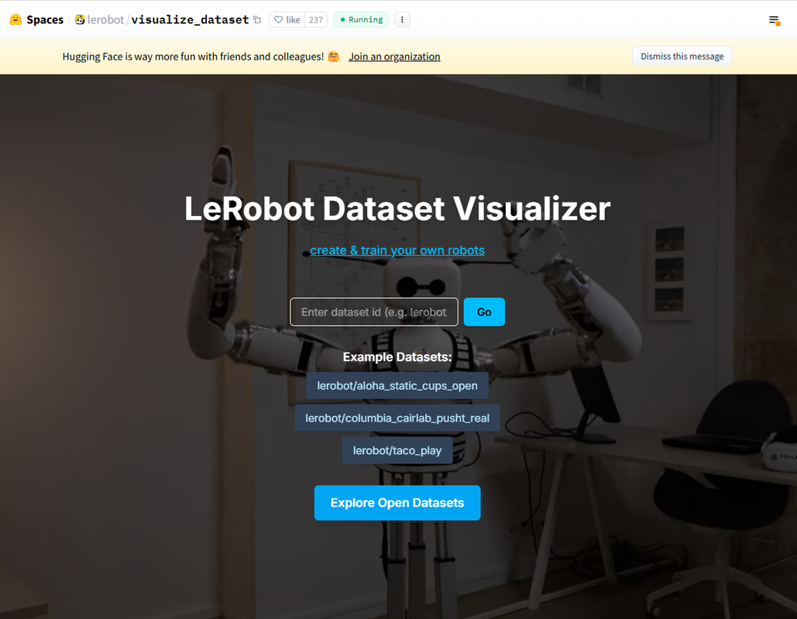
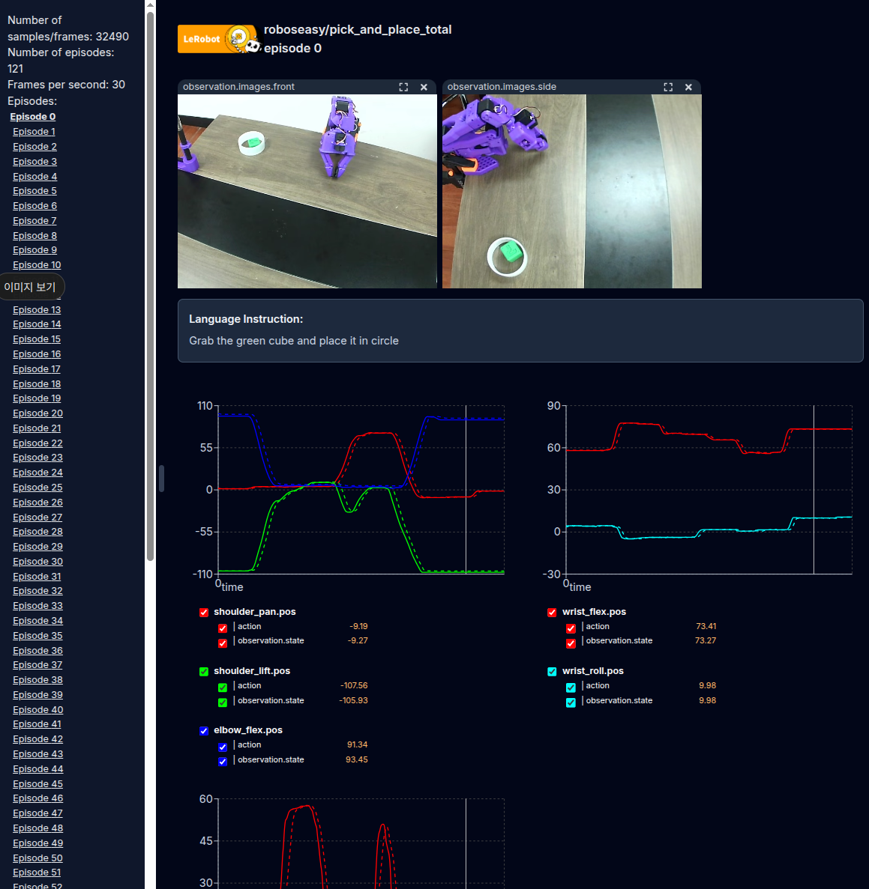

# Dataset Visualization

데이터셋 시각화 


## **데이터셋 시각화 (Visualize a dataset)**

### 방법 1: 온라인 시각화

**HuggingFace 웹 플랫폼 사용하기**
`--control.push_to_hub=true` 옵션을 사용하여 데이터셋을 허브에 업로드했다면, 다음 명령어로 제공되는 저장소 ID를 복사하여 붙여넣으면 온라인에서 데이터셋을 시각화할 수 있습니다.

[HuggingFace 웹 플랫폼](https://huggingface.co/spaces/lerobot/visualize_dataset)

자신의 계정에서 확인하고 싶은 데이터셋 레포 id를 복사하고 붙여넣기를 한 이후 "Go" 버튼을 눌러주면, 아래와 같이 각 에피소드 별로 확인할 수 있습니다.



### 방법 2: 로컬 시각화

가장 간단한 방법으로, 로컬 머신에서 즉시 Rerun 뷰어를 띄워 데이터를 확인합니다.

명령줄 도구를 사용하여 로컬에서 데이터셋의 에피소드를 시각화할 수도 있습니다:

```bash

export HF_USER="roboseasy" 
export TASK_NAME="pick_and_place" 
export TASK_DESCRIPTION="Pick a ball and place"
```

```bash

lerobot-dataset-viz \
    --repo-id=${HF_USER}/${TASK_NAME} \
    --episode-index=0 \
    --display-compressed-images=true
    
```

-   `--root`를 생략하면 HuggingFace 캐시 폴더(`~/.cache/huggingface/`)에서 데이터를 찾고, 없으면 Hub에서 다운로드합니다.
-   `--root ./roboseasy/pick_and_place`를 지정하면 해당 로컬 경로에서 직접 데이터를 로드합니다.
-   `--mode local`은 기본값이라 생략해도 동일합니다. (`distant`로 설정하면 웹 브라우저로 볼 수 있음)

실행되면 도구가 `rerun.io`를 열고 선택한 에피소드의 카메라 스트림, 로봇 상태 및 행동을 표시합니다.



원격 서버에 저장된 데이터셋 시각화를 포함한 고급 사용법은 다음을 실행하십시오:

```bash

lerobot-dataset-viz --help

```